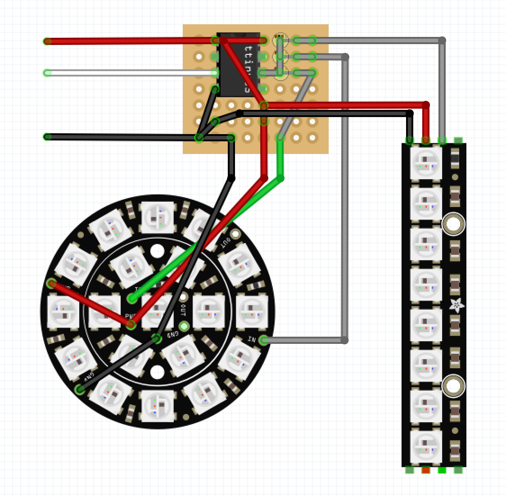
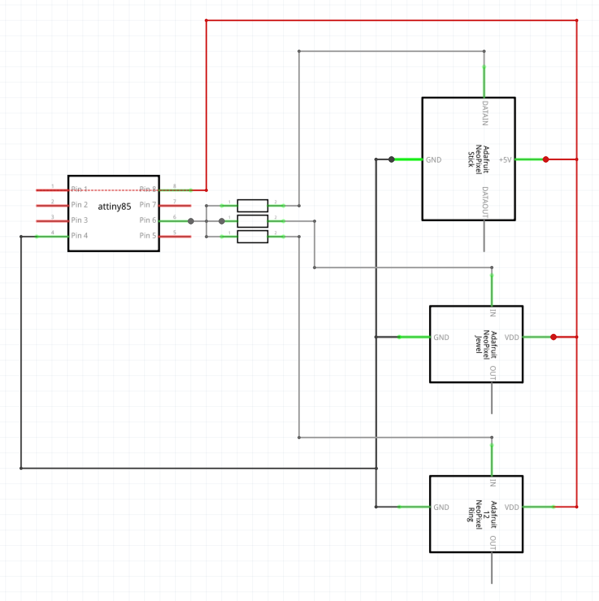

# NeoPixel Lighting Controller for Pi Cam Studio

Pi Cam Studio is a set of 3D models for a Raspberry Pi holder with a Pi camera holder and two LED light stands for use with OctoPrint. This is the code for an ATTiny85 that goes into each lighting can to generate the serial bitstream to drive the NeoPixel rings and strips. The lights fade up and down based on a control pin. A gamma curve and dithering are used to give a very slow smooth fade. Adafruit Neopixel strips and rings are used, the warm-white variants give a very nice color temperature.

## Getting Started

This project is built using PlatformIO on Atom.

## Component Layout

## Circuit Diagram

## Components

- 1 x [ATTiny85](https://www.amazon.com/gp/product/B00PT4XU04)
- 1 x 8 pin socket
- 7 x 8 hole perf board
- 3 x 100Ω resistor
- 1 x [12 NeoPixel ring](https://www.adafruit.com/product/1643)
- 1 x [7 NeoPixel ring](https://www.adafruit.com/product/2226)
- 2 x [3 pin terminal block](https://www.adafruit.com/product/2136)

The second light uses a third LED strips
- 1 x [8 NeoPixel strip](https://www.adafruit.com/product/1426)

## License

This project is licensed under the MIT License - see the [LICENSE.md](LICENSE.md) file for details
